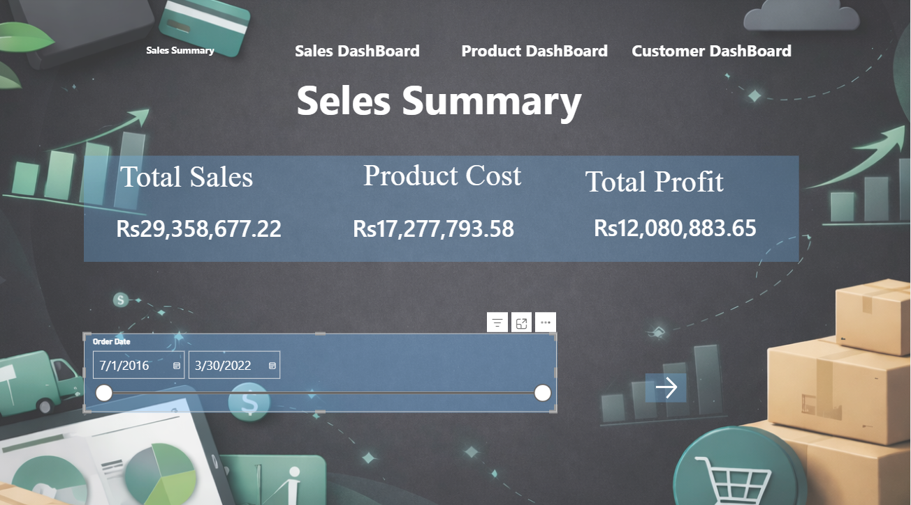
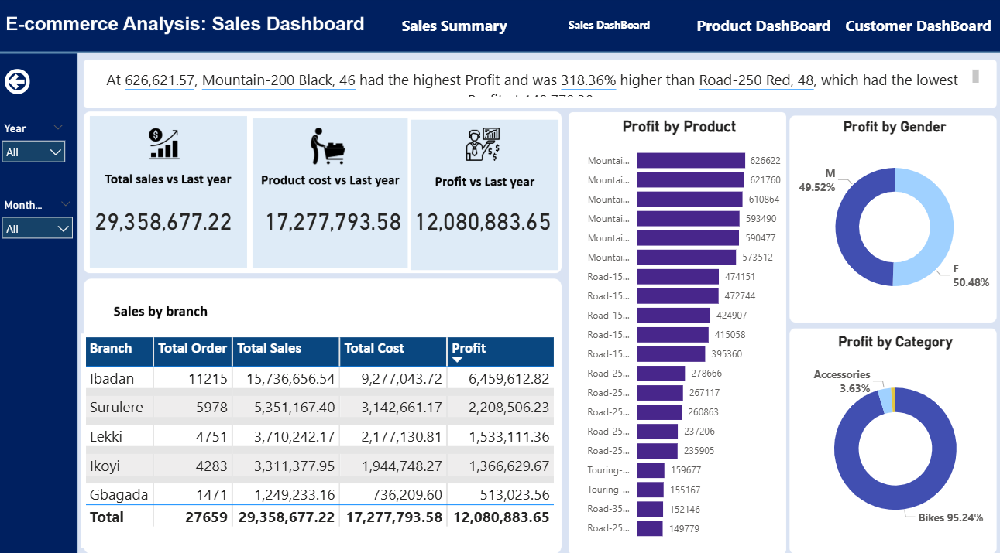
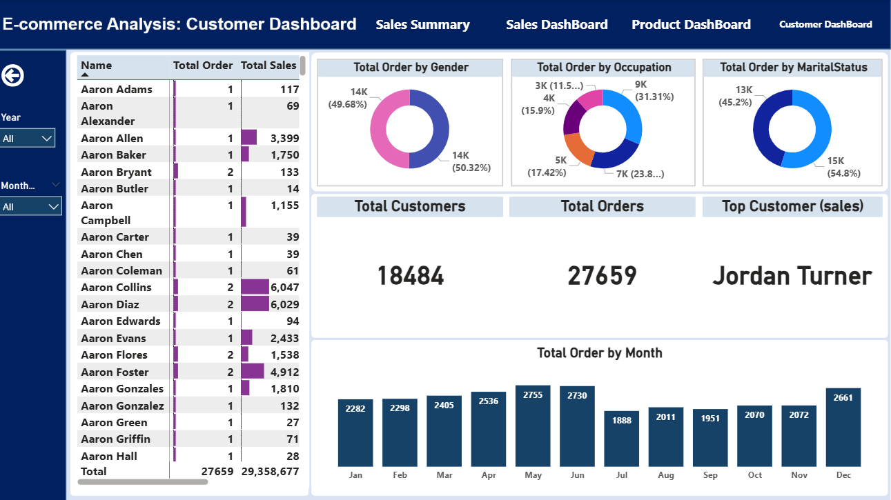

# 📊 E-Commerce Sales Analysis Dashboard (Power BI)

A professional and interactive **Power BI dashboard** built to analyze
e-commerce sales performance using structured business data.\
This project demonstrates data modeling, KPI tracking, and visual
storytelling for business decision-making.

> **Author:** Saeed Ullah\
> **Tool:** Microsoft Power BI\
> **Dataset:** AdventureWorks (Excel)

------------------------------------------------------------------------

## 🚀 Project Overview

This dashboard provides a complete view of an e-commerce business,
helping stakeholders monitor:

-   Sales performance\
-   Revenue trends\
-   Product and category performance\
-   Customer insights\
-   Regional analysis

The goal is to transform raw transactional data into meaningful insights
using interactive visuals and KPIs.

------------------------------------------------------------------------

## 🧩 Key Features

✔️ Interactive slicers for filtering by product, region, and time\
✔️ Dynamic KPIs for revenue, sales quantity, and growth\
✔️ Trend analysis with monthly and yearly comparisons\
✔️ Category and product-level breakdown\
✔️ Clean, professional UI layout\
✔️ Fast insights for business users

------------------------------------------------------------------------

## 🖼️ Dashboard Screenshots

### 📌 Main Overview



### 📌 Sales Performance Analysis



### 📌 Product & Category Insights


### 📌 Detailed Analytics View



------------------------------------------------------------------------

## 📁 Repository Structure

    E-commerce-DashBoard/
    │
    ├── Data/
    │   └── adventureworks database.xlsx
    │
    ├── Report/
    │   └── E-Commerce Analysis Dashboard.pbix
    │
    ├── ScreenShot/
    │   ├── 1.png
    │   ├── 2.png
    │   ├── 3.png
    │   └── 4.png
    │
    ├── Image/
    │   └── Background assets
    │
    └── README.md

------------------------------------------------------------------------

## 🛠️ Tools & Technologies

-   Power BI Desktop\
-   Microsoft Excel\
-   DAX (Measures & Calculations)\
-   Data Modeling\
-   Data Visualization

------------------------------------------------------------------------

## 📥 How to Run the Project

1.  Clone the repository

```{=html}
<!-- -->
```
    git clone https://github.com/saeedullah111/E-commerce-DashBoard.git

2.  Open Power BI Desktop

3.  Open:

```{=html}
<!-- -->
```
    Report/E-Commerce Analysis Dashboard.pbix

4.  Update the data source path if required:

-   Transform Data → Data Source Settings
-   Select:

```{=html}
<!-- -->
```
    Data/adventureworks database.xlsx

5.  Click Refresh

------------------------------------------------------------------------

## 📊 Data Source

AdventureWorks Excel dataset containing:

-   Sales transactions\
-   Product details\
-   Customer information\
-   Time-based metrics\
-   Regional attributes

------------------------------------------------------------------------

## 🎯 Learning Objectives

-   Power BI modeling best practices\
-   DAX measure development\
-   Interactive dashboard design\
-   Business storytelling through visuals

------------------------------------------------------------------------

## 🤝 Contribution

Fork the repo, create a feature branch, commit changes, and submit a
pull request.

------------------------------------------------------------------------

## ⭐ Support

If you find this project useful, please give it a ⭐ on GitHub.
